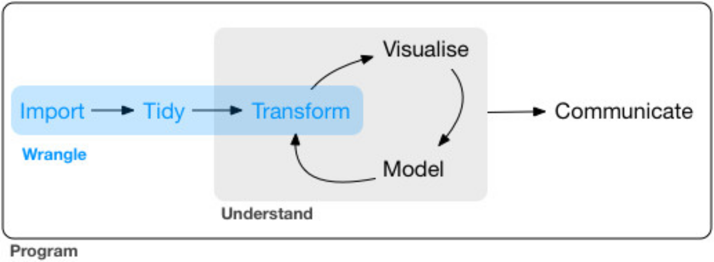
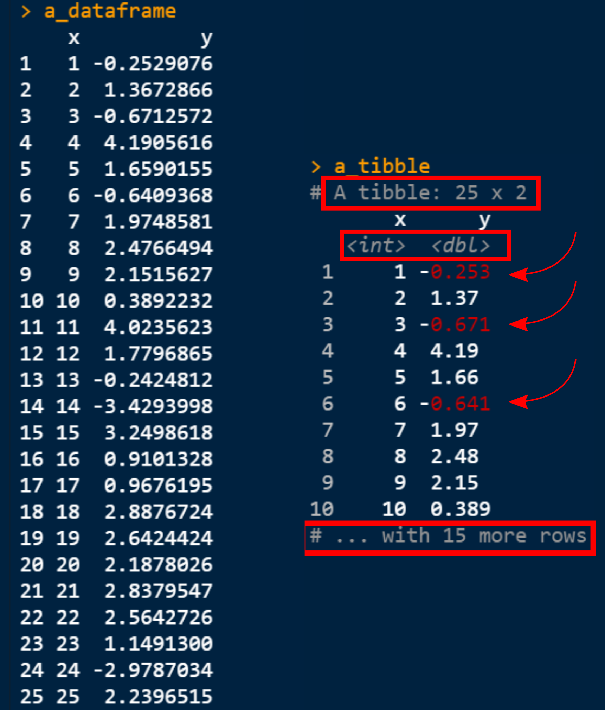
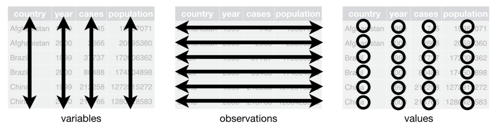

```{r setup, include=FALSE}
library(knitr)
library(rmdformats)

## Global options
options(max.print="120")
opts_chunk$set(#echo = FALSE,
	             #cache = TRUE,
               #prompt = FALSE,
               #tidy = TRUE,
               comment = NA#,
               #message = FALSE,
               #warning = FALSE
  )
opts_knit$set(width = 120)

```

```{r colorize function, include = FALSE}
  # colour text
colorize <- function(x, color) {
  if (knitr::is_latex_output()) {
    sprintf("\\textcolor{%s}{%s}", color, x)
  } else if (knitr::is_html_output()) {
    sprintf("<span style='color: %s;'>%s</span>", color,
      x)
  } else x
}
```

## 0. Prerequisites

### 0.1 Target audience

This course is targeted at Master's and Ph.D. students with a basic understanding of the R programming language, but want to manipulate (large) datasets with more ease than using spreadsheet software. In other words, being comfortable with basic R operations is a required.

If you *can* answer the following questions without much of a hassle, please move on to [0.2 Preparations]:

-   What does the `<-` operator do?

-   How to create a vector with the values `"this"`, `"is"`, `"a"`, `"vector"`?

-   How to access R's built-in help files (also referred to as "R documentation") for the function `shapiro.test`?

-   How to install and load a new package into your R session?

-   Why *doesn't* the following piece of code work (run code in an R session to check):

    ```{r, collapse = TRUE, eval = FALSE}
    foobar <- data.frame(x = 1:10, y = rnorm(10, 5, 1))
    plot(FOOBAR)
    ```

In case you had trouble with *any* of these questions, please take some time to get comfortable with some R basics. As we have a lot of ground to cover, it would be unwise to jump in unprepared! I strongly recommend the `swirl` package, which interactively introduces you to R (see [**swirl's website**](https://swirlstats.com/students.html) for more information). To get started with `swirl` right away, install the package using `install.packages("swirl")`, load it into your session with `library(swirl)` and jump-start your journey with `swirl()`. Going through the first chapter (`1: Basic Building Blocks`) should suffice, but don't let that stop you from learning moRe!

### 0.2 Preparations

**Please go through all of the steps below before attending the workshop!!**

Make sure to have at least `R version 4.1.0` installed on your computer. Additionally, I strongly recommend installing RStudio, as I will be using this as my Integrated Development Environment (IDE) throughout this course.

-   Installing R: <https://www.r-project.org/>
-   Installing RStudio: <https://www.rstudio.com/products/rstudio/download/#download>

Finally, install tidyverse using `install.packages("tidyverse")`.

### 0.3 Overview {data-link="0.2 Preparations"}

For an overview of all sections covered within this material, please refer to the sidebar of this document or use the hyperlinks shown below. Sections 1 to 4 are not required for working with `tidyverse`, but are recommended to expand your understanding of how these packages work the way they do. Additionally, you'll learn how to deal with importing data, including a section on larger datasets. Starting from section 5, we will get our hands dirty with actual `tidyverse` data manipulation.

[1. Introduction]\
[2. The whole game]\
[3. Tibbles and pipes]\
[4. Importing data]\
[5. Data manipulation with `dplyr`]\
[6. Tidy data with `tidyr`]\
[7. DataViz: `ggplot2`]\
[8. Life cycle]\
[9. Cheat sheets]

## 1. Introduction

### 1.1 Context

As a biology student, I was introduced to R in the very first year of the programme. With R being my first scripting language, it was as much an uphill struggle as any other new language. In the second year, R was thrown on the table again in the context of statistics, with another round of RStats in the Master's programme, 2 years later. In this time, I used R only as a means to perform statistical tests. As real, raw data was rarely in the format that was presented during any of the statistical courses, I cleaned, filtered, pivoted, ... all of it using MS Excel. If you haven't already, this can be a very time- and energy-consuming endeavour! Indeed, we never really learned how to clean and wrangle our datasets, leading to a lot of trouble and frustration toward data analysis.

During my thesis, however, I found out about 'Tidyverse', but never *truly* submerged myself. At the start of my Ph.D. in October 2020, I seized the moment to learn the ropes of this set of packages, and I haven't looked back since (and learned more about R along the way, as well). To potentially save you a lot of time and trouble - whether you are a Master's or Ph.D. student, or even something beyond that -, I want to share with you some of the things I have learned along the way. For the record, I'm far from an expert on the matter, and there is still a lot left to explore!

This origin story aside, hopefully this material will prove to be helpful somewhere along your data journey. There are many ways to deal with data tidying and wrangling, and the `tidyverse` just happens to be the one I prefer at the moment. Feel free to send me any and all feedback you may have to [Stijn.VandeVondel\@uantwerpen.be](mailto:Stijn.VandeVondel@uantwerpen.be){.email}.

### 1.2 Tidyverse

The [tidyverse](https://www.tidyverse.org/ "Tidyverse.org") is "*an opinionated collection of R packages designed for data science*". In that sense, `tidyverse` can be represented as a virtual basket containing different packages, which "*all share an underlying design philosophy, grammar, and data structures*". In other words, these packages and their corresponding functions easily interact with each other, allowing for a wide range of tools to tinker with data.

If you haven't already, install the `tidyverse` (`install.packages("tidyverse")`) and load it into your R environment.

```{r load tidyverse, collapse = TRUE, warnings = FALSE}
  # load tidyverse
#install.packages("tidyverse")
library(tidyverse)

```

As shown above, a series of packages will be installed. Each of these packages is listed below, along with a brief description borrowed from the packages' documentation. In addition to these 'core' packages, other R libraries are also installed along with `tidyverse`, but are mostly beyond the scope of this workshop.

-   [**ggplot2**](https://ggplot2.tidyverse.org/): A system for 'declaratively' creating graphics, based on "The Grammar of Graphics".
-   [**dplyr**](https://dplyr.tidyverse.org/): `dplyr` provides a grammar of data manipulation, yielding a consistent set of verbs that solve the most common data manipulation challenges.
-   [**tidyr**](https://tidyr.tidyverse.org/): `tidyr` provides a set of functions that help you acquire tidy data. Tidy data is data with a consistent form: in brief, every variable goes in a column, and every column is a variable. This is part of the *core philosophy of tidy data*.
-   [**readr**](https://readr.tidyverse.org/): `readr` provides a fast and friendly way to read rectangular data (like .csv, .tsv, and .fwf). It is designed to flexibly parse many types of data found in the wild, while still cleanly failing when data unexpectedly changes.
-   [**purrr**](https://purrr.tidyverse.org/): `purrr` enhances R's functional programming toolkit by providing a complete and consistent set of tools for working with functions and vectors. Once you master the basic concepts, purrr allows you to replace many for loops with code that is easier to write and more expressive.
-   [**tibble**](https://tibble.tidyverse.org/): `tibble` is a modern re-imagining of the data frame, keeping what time has proven to be effective, and throwing out what it has not. Tibbles are data.frames that are lazy and surly: they do less and complain more forcing you to confront problems earlier, typically leading to cleaner, more expressive code.
-   [**stringr**](https://stringr.tidyverse.org/): `stringr` provides a cohesive set of functions designed to make working with strings as easy as possible. It is built on top of `stringi`, which uses the ICU C library to provide fast, correct implementations of common string manipulations.
-   [**forcats**](https://forcats.tidyverse.org/): `forcats` provides a suite of useful tools that solve common problems with factors. R uses factors to handle categorical variables; variables that have a fixed and known set of possible values.
-   Others: `broom`, `cli`, `crayon`, `dbplyr`, `dtplyr`, `googledrive`, `googlesheets4`, `haven`, `hms`, `httr`, `jsonlite`, `lubridate`, `magrittr`, `modelr`, `pillar`, `readxl`, `reprex`, `rlang`, `rstudioapi`, `rvest`, `xml2`

If you have already installed `tidyverse` earlier, you may want to check whether all packages contained within are up-to-date.

```{r update tidyverse, eval = FALSE}
  # check for updates
tidyverse::tidyverse_update()

```

If a package is out of date, you will receive a notification and instructions to update outdated packages.

```{r, echo=FALSE, out.width="60%", fig.cap = "Try `tidyverse_packages(include_self = TRUE)` and see for yourself!", fig.align="center", fig.retina = 2}

```

### 1.3 Package conflicts: masking

As shown in [1.2 Tidyverse], `library(tidyverse)` attaches multiple packages to your R session. Additionally, a couple of so-called **Conflicts** will be shown. As these conflicts are not exclusive to `tidyverse`, but become apparent when you start loading packages into R, it is important to know what *exactly* these conflicts entail.

```{r conflicts, echo = FALSE, collapse = TRUE}
tidyverse_conflicts()
```

In English, `filter()` and `lag()` from the `dplyr` package share their names with `filter()` and `lag()` from the `stats` package (included with any R installation). In other words, once `dplyr` has been attached to your R session, `filter()` and `lag()` from the `stats` package will no longer be accessible (unless called *explicitly* using e.g. `stats::filter()` ). The `::` in `dplyr::filter()` indicates that `filter()` originates from the **namespace** of `dplyr` ("the space in which all names, belonging to a package, reside"). More specifically, `::` allows accessing a specific package's functions *without* loading the entire package into R (see `?'::'` for more details).

If you end up working with many different packages, you will need to take such conflicts into account. One error I have come across very often, is whenever using `dplyr` and `raster` (in case I load `raster` *after* `tidyverse`, thereby masking `dplyr::select` with `raster::select)`.

```{r conflicts2, eval = FALSE}
  # load packages
library(tidyverse)
library(raster)

Loading required package: sp

Attaching package: ‘raster’

The following object is masked from ‘package:dplyr’:

    select

The following object is masked from ‘package:tidyr’:

    extract

  # select 'artist' and 'track' columns
billboard %>% 
  select(artist, track)

Error in (function (classes, fdef, mtable)  : 
  unable to find an inherited method for function ‘select’ for signature ‘"spec_tbl_df"’
```

Even though we were already warned that `dplyr::select` was masked by `raster::select`, we still tried using the `select()` function as if it was called from the `dplyr` package. Instead, `select()` was called from the `raster` package (which is aimed at geometrically subsetting raster or spatial objects), triggering the error.

Another way to find out which namespace a function is called from, is by entering a function's name (*without* brackets `()`) in your R console. In case of the code above, the following message would be printed for `select`:

```{r conflicts3, eval = FALSE}
standardGeneric for "select" defined from package "raster"

function (x, ...) 
standardGeneric("select")
<bytecode: 0x000002a8f658cda0>
<environment: 0x000002a8f6968a48>
Methods may be defined for arguments: x
Use  showMethods(select)  for currently available ones.
```

## 2. The whole game

### 2.1 In a nutshell

> "Tidy datasets are all alike, but every messy dataset is messy in its own way." `r tufte::quote_footer("Hadley Wickham, a play on Tolstoy's “Happy families are all alike; every unhappy family is unhappy in its own way.”")`

**More often than not, raw data will not be formatted in a very accessible, analysis-friendly way.** Experiments generally do not produce clean *trees.csv* or *covid_cases.csv* files, but datasets that are wild, exotic or downright savage. This is especially likely if someone else collected data *for* you, but did not have any prior knowledge about your general set-up. If you cannot recall hours of tedious data tinkering in Excel following a group lab practical, then have you really lived your student life to the fullest? ;-)

```{r, echo=FALSE, out.width="60%", fig.cap = "If only Robbie would stop bothering Alexa...            Source: [Jon Carter](https://www.kdnuggets.com/2017/09/cartoon-machine-learning-class.html)", fig.align="center"}

```

To deal with such datasets, rigorous cleaning and wrangling is required before even thinking about modelling or visualizing the story residing within your data. The schematic below (as shown in [R for Data Science](https://r4ds.had.co.nz/); great reference material!) encompasses the entire process of data science with `tidyverse`; this course is (mostly) limited to the parts **`r colorize("highlighted in blue", "#169EFC")`**. Most importantly, **data tidying** and **transformation** will be taking center stage, with some notes on **importing data** and dipping our toes in **visualization**.

```{r, echo=FALSE, out.width="70%", fig.cap = "Data wrangling. Source: [R for Data Science](https://r4ds.had.co.nz/wrangle-intro.html)", fig.align="center"}

```

### 2.2 Data cleaning vs data wrangling

The above schematic in words: Raw data first needs to be **imported** by loading it into the R environment (which *usually* means effectively loading data into memory (RAM)). Once loaded, data often requires **tidying** (or *data cleaning*) and **transformation** (or *data wrangling*) prior to any analyses down the line. In more exact terms, **data cleaning** is the **process through which errors are fixed and data quality is ensured**, while **data wrangling** would be defined as the **process through which raw data is manipulated and transformed**. As tools for both processes can often be used interchangeably, I will not distinguish between these definitions. For the sake of everyone's convenience, I will simply talk about **data wrangling** as a whole.

## 3. Tibbles and pipes

Before diving head first into the `tidyverse`, we will need to talk about **tibbles** and **pipes.** Very many functions within the `tidyverse` produce tibbles, making it at least worth mentioning. Pipes, on the other hand, are a powerful tool for clearly expressing a sequence of multiple operations.

### 3.1 Tibbles

**Tibbles are dataframes**, but with a twist. For the sake of comparison and clarification, we will create a classical R data frame and a tibble with the same content.

```{r tibbles, collapse = TRUE}
  # set seed for reproducibility
set.seed(1)
  
  # create a dataframe
a_dataframe <- data.frame(x = 1:25,
           y = rnorm(25, 1, 2))

  # create a tibble from the dataframe
a_tibble <- as_tibble(a_dataframe)

```

Here, we have created two datasets, each containing the same information: column `x` with numbers from 1 to 25, and column `y` with 25 random observations drawn from a normal distribution. Both have the same number of variables (2) and observations (25), and will produce the same results (try running e.g. `all.equal(mean(a_dataframe$y), mean(a_tibble$y))`). This begs the question of *what*, exactly, is different?

One hint toward the answer can be obtained by running both objects (simply `a_dataframe` and `a_tibble` in the R console) and reviewing the output.

```{r, echo = FALSE, out.width="60%", fig.cap = "A regular dataframe (left) and a tibble (right). The tibble shows a couple of distinct features to improve printing and inspection of your data.", fig.align="center"}

```

As shown in the figure above, a couple of features are shown in a tibble that are non-existent for 'regular' dataframes. In a way, a tibble is nothing more than a data frame with some extra 'quality of life' features. However, there are other important differences going on under the hood, encapsulating best practices for data frames. Read more on tibbles [here](https://tibble.tidyverse.org/reference/tbl_df-class.html).

### 3.2a Pipes: short version

Pipes are a special operator aimed at making code more intuitive to read and write (though opinions may differ). The `tidyverse` pipe is written as `%>%` (`CTRL+SHIFT+M` in RStudio) and originates from the `magrittr` package ([to be pronounced with a sophisticated french accent](https://cran.r-project.org/web/packages/magrittr/vignettes/magrittr.html)). They are automatically loaded in with `library(tidyverse)`, but can also be loaded separately using `library(magrittr)` or `library(magrittr, include.only = "%>%")`.

In brief, the `magrittr` pipe passes the output of what comes *before* the pipe (left-hand side) as input to the function *after* the pipe (right-hand side). The pseudo-code below shows what this looks like in the context of baking cookies in a factory, going through the functions and pipes as if it were a conveyer belt or *pipeline*.

```{r yummie cookies A, eval=FALSE}
raw_ingredients <- ("butter", "sugar", "eggs", "chocolate chips", "...")

choc_chip_cookies <- raw_ingredients %>% 
  make_dough() %>% 
  shape_cookie() %>% 
  transport_to_oven() %>% 
  bake_yummie_cookies() %>% 
  cool_cookies() %>% 
  pack() %>% 
  send_away()
  
```

In case you don't completely understand the `%>%` yet, I've written a more lengthy section below ([3.2b Pipes: long version]). It will help you to better grasp the benefits of the operator, but is not required to get you going with `tidyverse`. **The bottom line remains:** `%>%` **passes what comes *before* to what comes *after* the pipe**, effectively creating a virtual pipeline of consecutive operations.

### 3.2b Pipes: long version

To give you a working example, I will provide some code (see below) with one of the most used built-in R datasets: `mtcars`. Don't worry too much about the different functions used (we will get back to most of those later!), but pay attention to the use of the `%>%` operator in example 1.

```{r piping}
  # example 1: piping
df_cars <- mtcars %>% 
  rownames_to_column("car") %>% 
  filter(str_detect(car, "Merc")) %>% 
    # convert miles per gallon -> km per liter
  mutate(kml = mpg*(1.60934/3.78541)) %>% 
  select(car, kml, cyl, hp)
```

As the benefit of the `%>%` will not immediately become clear following this example, consider the following code blocks (examples 2 to 4):

```{r no piping1}
  # example 2: nesting
df_cars <- select(
  mutate(
    filter(rownames_to_column(mtcars, "car"), str_detect(car, "Merc")),
    kml = mpg*(1.60934/3.78541)), 
  car, kml, cyl, hp)
```

```{r no piping2}
  # example 3: overwriting
df_cars <- rownames_to_column(mtcars, "car")
df_cars <- filter(df_cars, str_detect(car, "Merc"))
df_cars <- mutate(df_cars, kml = mpg*(1.60934/3.78541))
df_cars <- select(df_cars, car, kml, cyl, hp)
```

```{r base R}
  # example 4: base R
df_cars <- mtcars
df_cars$car <- row.names(df_cars)
df_cars <- df_cars[, c(ncol(df_cars), 1:ncol(df_cars)-1)]
df_cars <- df_cars[grep("Merc", df_cars$car), ]
row.names(df_cars) <- NULL
df_cars$kml <- df_cars$mpg*(1.60934/3.78541)
df_cars <- df_cars[c("car", "kml", "cyl", "hp")]

```

**All of the above examples will yield the same `df_cars` object at the very end.** In my humble opinion, **example 1** is the most readable and maintenance-friendly code *by far* (but, again, mileage and opinions may vary). Once you become used to piping multiple operations together into one chain, you no longer need to intermediately save or overwrite old data (with some exceptions that are bound to cross your path). Additionally, code becomes more intuitive and readable if used correctly.

Another thing you may (or may not) have noticed, is how in **example 1** (as well as in **example 2**, but for different reasons) `df_cars` is only mentioned *once*, while **example 3** and **4** mention the object `df_cars` **7** and **15**(!!) times, respectively. As for **example 2**, nesting all of the functions limited the number of mentions of `df_cars`, at the cost of readability. Naturally, one could also nest some of the operations in **example 4**, but I think we all have better things to do!

In any case, where is each function in example 1 getting their data from, or how does it know which one to use? And what is the order of execution of each of these function calls? To explain this, imagine a factory that produces your favourite type of cookie - I will go with the classic ol' chocolate chip. At one end, raw ingredients (butter, sugar, eggs, chocolate chips, ...) are delivered to the factory's doorstep. At the other end, the factory pumps out boxes chock-full of delicious cookies.

Of course, we all know the factory isn't a [black box](https://www.merriam-webster.com/dictionary/black%20box), but rather an intricate system of many different steps. **First**, raw ingredients need to be mixed into a batter and thickened into a dough. **Next**, this dough is poured into moulding machines where the cookies are given their iconic shape. **Then**, the cookie-shaped dough moves down a conveyor belt to an industrial oven for baking. **Finally**, *after* cooling these heavenly cookies, they are packed and sent away. Let's write this into some pseudo-code using the `magrittr` pipe:

```{r yummie cookies B, eval=FALSE}
raw_ingredients <- ("butter", "sugar", "eggs", "chocolate chips", "...")

choc_chip_cookies <- raw_ingredients %>% 
  make_dough() %>% 
  shape_cookies() %>% 
  transport_to_oven() %>% 
  bake_yummie_cookies() %>% 
  cool_cookies() %>% 
  pack() %>% 
  send_away()
  
```

In case you hadn't noticed yet, **the pipe passes the output from the function *before* it, to the function after the pipe** (in the example above, it passes the output from the first line to the next line as the input). As such, `raw_ingredients` is passed on to `make_dough()`, and the result of `make_dough()` is passed on to `shape_cookies()`. Once the data has gone through `send_away()`, it is stored in the object called `choc_chip_cookies` - the finished box of cookies, if you will. In terms of the code above, you could also write each of the cookie-making steps on one line of code (like a virtual conveyor belt), but this would make the code much less readable (head on over to [this style guide](https://style.tidyverse.org/) for more info on code styling within tidyverse).

Without going into too much detail, this behaviour is also engrained into most `tidyverse` functions. Most of these functions use the output of whatever comes *before* the pipe as the input for the operation *after* the pipe. If you want to explicitly refer to this input-output within these function calls, the dot (`.`) placeholder can be used:

```{r yummie cookies2, eval=FALSE}
raw_ingredients <- ("butter", "sugar", "eggs", "chocolate chips", "...")

choc_chip_cookies <- raw_ingredients %>% 
  make_dough(.) %>% 
  shape_cookie(.) %>% 
  transport_to_oven(.) %>% 
  bake_yummie_cookies(.) %>% 
  cool_cookies(.) %>% 
  pack(.) %>% 
  send_away(.)
  
```

For now, this is all you need to know about pipes (and far more than I knew when I started out). In brief, the magrittr pipe passes the output of what comes *before* the pipe (left-hand side) as input to the function *after* the pipe (right-hand side). For more technical information, see [here](https://magrittr.tidyverse.org/reference/pipe.html).

NOTE: Ever since `R version 4.1.0`, R also sports a native pipe operator `|>`. Its behaviour is highly similar to `%>%`, but is now part of the R language *itself*, while `%>%` needs to be imported from a package. For further reading, head on over to following [comparison](https://michaelbarrowman.co.uk/post/the-new-base-pipe/). The `|>` operator will not be covered in this course.

```{r, echo = FALSE, out.width="50%", fig.cap = "*'Ceci n'est pas une pipe'*, by Belgian artist René Magritte, which served to be the etymological inspiration for the [*magrittr*](https://cran.r-project.org/web/packages/magrittr/vignettes/magrittr.html) package.", fig.align="center"}
knitr::include_graphics("images/MagrittePipe.jpg")
```

### 3.3 Tidy data

As already touched upon in the description of the `dplyr` package, tidy data is data with a consistent form and follows three rules:

-   Each variable must have its own column.
-   Each observation must have its own row.
-   Each value must have its own cell.

```{r, echo = FALSE, out.width="70%", fig.cap = "The three rules of tidy data. Source: '[R for Data Science'](https://r4ds.had.co.nz/tidy-data.html)", fig.align="center"}

```

If data is tidy, then **every variable goes in a column, and every column is a variable.** Tidy data is not desirable in *all* cases, but can prove to be a very robust way of structuring data when using `tidyverse`. For those who have already worked with `ggplot2` may know what I am talking about! For more more information and examples, check [12.2 Tidy data in R4DS](https://r4ds.had.co.nz/tidy-data.html#tidy-data-1).

## 4. Importing data

### 4.1 `readr` and base R

As this workshop is more about the actual data cleaning and wrangling, I will only go over **importing data** very briefly.

Within `tidyverse`, the `readr` package was developed to provide a fast and friendly way to read rectangular data (e.g. csv). The `readr` functions you're likely to use most often are:

-   `read_csv()` to read comma (`,`) delimited files;
-   `read_csv2()` to read semicolon (`;`) separated files (a common file type in Belgium, where `,` is used as the decimal point);
-   `read_tsv()` to read tab delimited files;
-   `read_delim()` to read files with any delimiter.

As you may already know, base R also has tools to import data (e.g. `read.csv()`, `read.csv2`, `read.table()`, ...), but these are generally **slower** than those provided by `readr`. Regardless, this is unlikely to be an issue unless you are working with larger datasets (\>1 million observations).

### 4.2 Big data

In case your workflow is suffering from large data files, fear not - there are many powerful tools at your disposal! Introducing `vroom` and `data.table`. Both packages use multiple threading, which is very beneficial if your computer possesses multiple CPU cores (which is often the case, nowadays). This, along with some other nifty features, allows reading and writing data *very* fast (one could say *vrrroooom*). As opposed to `data.table`, `vroom` does not fully read data into memory, but only indexes it. This means that only columns and rows you would actually put to use would be read.

That said, `data.table` still ought to be faster in case of numeric data than `vroom`. On top of that, `data.table` provides tools and syntax to wrangle data much more efficiently than e.g. `tidyverse` functions. In addition, `data.table` is also faster and more memory-efficient in doing so, but its syntax is more difficult to read and write. As a compromise, `dtplyr` has been called into existence within the `tidyverse`, which uses the same 'tidy verbs' you'll become familiar with, but translates this into `data.table` syntax to benefit of its sheer speed (with some minor loss of speed due to [overhead](https://stackoverflow.com/questions/2860234/what-is-overhead/2860263), and loss of memory-efficiency). One additional thing I want to mention about `data.table` is its very convenient *and* fast way of reading (`fread`) and writing (`fwrite`) data with. It is highly similar to base R's `read.table()`, but automatically detects column separators, data types, and has many arguments to customize the function call.

Nevertheless, as of [`readr 2.0.0`](https://www.tidyverse.org/blog/2021/07/readr-2-0-0/), the package uses `vroom` as a backend, granting an impressive speed boost. Below, I provide a benchmark comparing base R's `read.csv()`, the previous (\**.old*) and current version of `read_csv()` (\**.new*), as well as `data.table::fread()` to import a `.csv` file containing 16 columns of \> 34 million rows, mostly numerical data (total size: 3.56 GB, uncompressed).

```{r comparison code, eval = FALSE, echo = FALSE}
  # define file path
path <- "D:/OneDrive/OneDrive - Universiteit Antwerpen/R projects/GIT/CurieuzeNeuzen-in-de-Tuin/data/database/all_2021-04-09_2021-06-27_tzUTCplus2.csv"

  # declare test functions
base.read.csv <- function() read.csv(path)
readr.read_csv.old <- function() readr::with_edition(1, readr::read_csv(path))
readr.read_csv.new <- function() readr::read_csv(path)
dt.fread <- function() data.table::fread(path)

microbenchmark::microbenchmark(
  base.read.csv(), 
  readr.read_csv.old(),
  readr.read_csv.new(), 
  dt.fread(),
  times = 5)
```

```{r comparison, eval = FALSE}
Unit: seconds
                 expr        min         lq       mean     median         uq        max neval
      base.read.csv() 111.372018 113.808849 114.516900 113.859472 116.155927 117.388234     5
 readr.read_csv.old()  37.959150  38.016099  38.741874  38.960399  39.156582  39.617139     5
 readr.read_csv.new()   4.326258   4.599566   4.941215   4.649826   4.681539   6.448888     5
           dt.fread()   3.465170   3.667079   3.716254   3.742631   3.815739   3.890653     5
```

There are ways to optimize functions (such as `read.table()`) to handle data more efficiently, or by parallelizing operations, but these are very situational and far beyond the scope of this workshop.

To find out more about [vroom](https://vroom.r-lib.org/) and [data.table](https://cran.r-project.org/web/packages/data.table/vignettes/datatable-intro.html), click on the embedded links.

## 5. Data manipulation with `dplyr`

Once you've loaded your data into R, it's time to start tinkering! A package that aims to make handling and manipulating data easier and more efficient is `dplyr` (pronounced d-ply-r), which you'll use most often when it comes to data manipulation. It presents itself as a *grammar of data manipulation*, providing a couple of functions to solve most common data manipulation challenges, also referred to as **verbs**: `select()`, `filter()`, `mutate()`, `arrange()`, etc.

These so-called verbs can be used together harmoniously, aiming to make data wrangling a much smoother and readable experience. For your reference, I will list the functions used in [5.10 Overview] each accompanied by a short description. Worked out examples will be provided in the next sections. Similar examples can be found in the package's vignette by using `vignette("dplyr")` in R. For sake of completion, I will provide some base R alternatives, as well ([dplyr\<-\>base R](https://dplyr.tidyverse.org/articles/base.html)).

Using one of the datasets included with `dplyr`, we will explore the world of [Star Wars](https://en.wikipedia.org/wiki/Star_Wars). As you can see below, we have 14 variables (columns) with 87 observations (rows), so we have a lot to work with! The `glimpse()` function is included in the `dplyr` package (but is actually exported from `tibble`, which, in turn, exported it from `pillar` - phew!), and gives us a 'glimpse' of the dataset.

```{r head star wars, collapse=TRUE}
glimpse(starwars, width = 75)
```

### 5.1 `select()`

Often, datasets will contain a lot of information you don't need. For this purpose, it can be useful to keep only the columns you are using in further analyses.

To select a column, simply type the name(s) of the column(s) you want to keep. Conversely, the same can be achieved by writing the column name(s) you don't need, preceded by the `-` operator. Compare the pieces of code below, as well as the results.

```{r select1, eval = FALSE}
  # select columns name, height, mass, homeworld and species
starwars %>% 
  select(name, height, mass, homeworld, species)

starwars %>% 
  select(-hair_color, -skin_color, -eye_color, -birth_year, -sex, -gender, -films, -vehicles, -starships)

  # base R solutions
starwars[c("name", "height", "mass", "homeworld", "species")]
subset(starwars, select = c(name, height, mass, homeworld, species))
```

You may be wondering whether there aren't any more efficient ways to select columns, rather than typing out each individual one. Fortunately, there are multiple ways to achieve the same result! In a lot of cases, the `:` operator can be used to select adjacent columns (`FROM:TO`), as shown below.

```{r select2, eval = FALSE}
starwars %>% 
  select(name:mass, homeworld, species)

starwars %>% 
  select(-c(hair_color:gender, films:starships))
```

You can even select columns without ever mentioning any (full) column names, using one of the **selection helpers**; see `?tidyselect::language` for a list of all `tidyselect` helper functions. Below, I will show `where()` and `contains()`.

```{r select3, eval = FALSE}
  # select all numeric columns
starwars %>% 
  select(where(is.numeric))

  # select all columns that contain the letter 'o'
starwars %>% 
  select(contains("o"))
```

Now we know how to use `select()`, let's apply it to already perform some cleaning! Because the columns `films`, `vehicles` and `starships` are list-columns, we will omit them from any further manipulations.

```{r select star wars, collapse=TRUE}
starwars <- select(starwars, -c(films, vehicles, starships))
```

### 5.2 `filter()`

Filtering can be performed for many reasons. Perhaps you are only interested in Star Wars characters with a certain hair or skin colour, a certain species, or characters who are at least as tall as [the expected average height of a healthy population as defined by the WHO growth reference standards](https://ourworldindata.org/human-height). Whatever your flavour may be, all of this can be done using `filter()` to return only specific rows.

```{r filter1, collapse = TRUE, eval = FALSE}
  # characters with a gold skin colour
starwars %>% 
  filter(skin_color == "gold")

  # base R solutions
starwars[starwars$skin_color == "gold", , drop = FALSE]
subset(starwars, skin_color == "gold")
```

If we want to take it a step further, we can also combine different statements together. Try running the following code:

```{r filter2, eval = FALSE}
  # return only characters that are:
    # masculine,
    # not with a golden skin colour, 
    # and at least 176.5 cm tall
starwars %>% 
  filter(gender == "masculine", 
         skin_color != "gold", 
         height >= 176.5)
```

Any of the base R relational operators (`?Comparison`) can be used in conjunction with `filter()`. By default, the `,` acts as the `&` operator within a `filter()` call.

We can also provide a vector to filter a column, for which the `%in%` operator is used. In conjunction with the `!` operator (preceding the column name you are filtering on), you can also exclude parts of your dataset. Try running the code below and spot the differences.

```{r filter3, eval = FALSE}
  # characters with eye_color == "blue" OR eye_color == "red"
starwars %>% 
  filter(eye_color %in% c("blue", "red"))

  # characters NOT with eye_color == "blue" OR eye_color == "red
starwars %>% 
  filter(!eye_color %in% c("blue", "red"))
```

However, there are also a couple of rows that contain multiple colours, as is shown by `unique(starwars$eye_color)`, meaning our current filtering methods are not completely waterproof. Without going into detail, the `stringr` package (included with `tidyverse`) provides a solution to overcome this issue (e.g. `stringr::str_detect()`). Run the following code to confirm that, indeed, all characters with red eyes (even if the character has multiple eye colours) are returned.

```{r filter4, eval = FALSE}
starwars %>% 
  filter(str_detect(string = eye_color, pattern = "red"))
```

Working with string vectors is a whole endeavour on its own and cannot be covered extensively within the scope of this course. If you are curious to know more about what is called "regular expression" (abbreviated to "regex"), feel free to head on over to [`stringr`'s vignette](https://stringr.tidyverse.org/articles/regular-expressions.html) for an introduction to regex using `stringr`.

### 5.3 `arrange()`

While `filter()` selects or omits certain rows, `arrange()` simply reorders them (i.e. no rows are removed). By default, it arranges rows in an ascending order. In case of character columns, they are reordered alphabetically (A-Z), while numeric columns will be ordered from smallest to largest. For the record, `arrange()` reorders the *entire* dataframe according to the column you have selected.

```{r arrange1, eval = FALSE}
  # reordering a character column from A to Z
starwars %>% 
  arrange(name)

  # reordering a numeric column from smallest to largest values
starwars %>% 
  arrange(height)
```

If we want to reorder rows in a descending order, then the helper function `desc()` can be used.

```{r arrange2, eval = FALSE}
  # reordering a numeric column from largest to smallest values
starwars %>% 
  arrange(desc(height))
```

Furthermore, multiple columns can be used for reordering. For completion's sake, I will also provide the base R equivalents. While the first column will be used for arranging the entire dataset, consecutive columns will be used as 'tie-breakers' (if at least two characters have the same skin colour, then they will be sorted by species in the example below).

```{r arrange3, eval = FALSE}
  # dplyr: arranging using multiple columns
starwars %>% 
  arrange(skin_color, species)

  # base R: arranging in ascending order using multiple columns
starwars[order(starwars$skin_color, starwars$species), , drop = FALSE]
```

### 5.5 `mutate()`

Whenever you want to create a new variable (whether it is created based on data in your dataframe or not), or you want to change the content of existing columns, `mutate()` is the function to use. Its syntax is simple, but very versatile. Let's start with a classic `dplyr` calculation: the [BMI](https://en.wikipedia.org/wiki/Body_mass_index) of each Star Wars character. Looks like good ol' [Jabba](https://starwars.fandom.com/wiki/Jabba_Desilijic_Tiure) *really* needs to watch his carbs!

```{r mutate1, eval = FALSE}
  # calculate BMI and arrange from highest to lowest
sw_bmi <- starwars %>% 
  mutate(bmi = mass/(height/100)^2) %>% 
  select(name:mass, bmi) 

sw_bmi %>% 
  arrange(desc(bmi))
```

What's cool about `mutate()` is that you can use newly created variables as part of the *same* `mutate()` call, as shown below. Let's pretend the [*force*](https://en.wikipedia.org/wiki/The_Force) is inversely related to a character's BMI times its birth year. First, we can calculate each character's BMI, after which we can use that newly created variable to obtain a character's force level. The runner-up may come as a surprise...

```{r mutate_force, eval = FALSE}
  # calculate the force based on an individuals mass
starwars %>% 
    mutate(
      bmi = mass/(height/100)^2, 
      the_force = 1/bmi*birth_year) %>% 
    select(name, the_force) %>% 
    arrange(desc(the_force)) 
```

You can also mutate existing columns 'in place'.

```{r mutate2, eval = FALSE}
  # transform columns
starwars %>% 
  mutate(
    height = height/100, 
    mass = mass*.5,
    skin_color = factor(skin_color)
  )
```

A more advanced and concise way of modifying multiple columns at the same time combines `across()` and `tidyselect` helper functions. Let's pretend, for one moment, that it would be interesting to multiply all numerical columns by 10. First, I'll show a more verbose (wordy, long-winded) piece of code, followed by a tidy version.

```{r mutate_across, eval = FALSE}
  # verbose code
starwars %>% 
     mutate(across(where(is.numeric), function(x) {x*10}))

  # tidy code
starwars %>% 
     mutate(across(where(is.numeric), ~.x*10))
```

In the code block above, `across()` allows using `select()`-wise semantics to manipulate multiple columns at the same time. This can be done by defining specific columns, but also by using helper functions such as `where()`. On all of the selected columns, a function is applied. The first approach uses the classic R syntax (`function(x) {do something}`), but its verbosity can hamper the code's readability at a glance. To this end, the [purrr-style lambda approach](https://adv-r.hadley.nz/functionals.html#purrr-shortcuts) (using `~` or 'twiddle') provides more concise syntax using shortcuts (e.g. `.x` as a placeholder for each column that is selected), which can make (short and simple) [anonymous functions](http://adv-r.had.co.nz/Functional-programming.html#anonymous-functions) much more readable. The same logic applies for named functions, as shown below.

```{r mutate_across2, eval = FALSE}
  # create function to multiply by 10
force10 <- function(x){
  x*10
}

  # apply function
starwars %>% 
  mutate(across(where(is.numeric), ~force10(.x)))
```

Creating new columns in base R isn't all too difficult either, but does not allow creating a piped workflow as shown in the tidyverse examples. Additionally, a newly created variable cannot be used within the function call that said variable was created in (as opposed to `mutate()`) , unless it is nested.

```{r mutate base, eval = FALSE}
transform(starwars, bmi = mass/(height/100)^2)
starwars$bmi <- starwars$mass/(starwars$height/100)
```

### 5.6 `group_by() and summarize()`

Sometimes, one simply wants to summarize a dataset, e.g. to calculate the average height or weight of Star Wars characters. For this purpose, `summarize()` **creates a new dataframe** that summarizes all observations defined in the function's input. Below, we calculate the average height and weight of Star Wars characters using the `height` and `mass` columns as input. Because we are also interested in the variation of the data used to calculate these metrics, we calculate the respective standard deviations using `sd()`. Looks like the average character weighs approximately 97 kg and is approximately 174 cm tall (although these metrics' standard deviations may provide some additional context)!

Keep in mind that `summarize()` (which can also be typed as `summarize()`; many `tidyverse` functions have synonyms facilitating use in both British and American English!) only retains the summary columns defined within the function call!

```{r summarize1, eval = FALSE}
starwars %>% 
  summarize(average_height = mean(height, na.rm = TRUE),
            stdev_height = sd(height, na.rm = TRUE),
            average_weight = mean(mass, na.rm = TRUE),
            stdev_weight = sd(mass, na.rm = TRUE))
```

We can up the ante by calculating the average height of characters *between species*. In other words, we want to summarize our data based on groups within that data. To tell R we want to perform such grouped operations, we use `group_by()`, subsequently calculating our summary data with `summarize()`. We will use an intermediate `filter(n() >= 3)` step to include *only* species who count at least 3 individuals in our dataset, and remove rows that contain `NA` in the `species` column using `tidyr::drop_na()`. For that purpose, `dplyr::n()` can be used to return the sizes of each group.

```{r summarize2, eval = FALSE}
starwars %>% 
  group_by(species) %>% 
  filter(n() >= 3) %>% 
  drop_na(species) %>% 
  summarize(average_height = mean(height, na.rm = TRUE), 
            average_weight = mean(mass, na.rm = TRUE), 
            individuals = n()) %>% 
  arrange(-average_height, -average_weight)
```

As you can see, grouping can be very powerful and versatile. In the example above, we group our dataset by `species`, filter it to keep only groups that contain *at least* 3 observations, and `summarize()` to calculate some averages and the size of our groups. This works because **grouping** can be used by most `dplyr` functions (`mutate()`, `filter()`, `summarize()`, ...). Notice how the grouping variable (species) is retained in the resulting dataframe!

However, with great grouping power comes great grouping responsibility! Cheesiness aside, errors and unpredictable behaviour can occur when one isn't mindful of their groupings. That is, `group_by()` does not alter the data points themselves, but alters the *structure* of your data as a whole.

```{r group1, collapse = TRUE}
sw_subset <- starwars %>% select(name, height, mass, gender)

sw_subset_gr <- sw_subset %>% group_by(gender)

  # ungrouped data
glimpse(sw_subset, width = 75)

  # grouped data
glimpse(sw_subset_gr, width = 75)

```

Indeed, the `glimpse()` function (alternatively, you can use `str()` or simply print the dataframe to your console) shows an additional line of information for `sw_subset_gr`, which is not shown for the ungrouped data: `Groups: gender [3]`. This implies that grouping is applied to the `sw_subset_gr`, meaning subsequent operations will take this into account whenever possible (such as the `filter(n() => 3)` used earlier).

To remove grouping, either use `summarize()` in case you want to create a summary of your data, or `ungroup()` if you simply want to remove the grouping without any other manipulations.

My personal take on grouping and ungrouping is that I will *always* (try to) add `ungroup()` following the use of `group_by()`, *even*, if I have already used `summarize()`. Even though `summarize()` removes a layer of grouping, the additional use of `ungroup()` makes the operation explicit, clearly conveying that your functions operate on grouped or non-grouped data. The examples provided earlier do not conform with this notion for the sake of brevity.

[**Bonus:**]{.ul} `count()` provides a 'quick and dirty" convenience function so you can easily count e.g. the number of individuals that share the same `species` name, rather than going through a separate `group_by()` and `summarize()` call.

```{r count, eval = FALSE}
starwars %>% 
  count(species) %>% 
  arrange(-n)
```

instead of

```{r count2, eval = FALSE}
starwars %>% 
  group_by(species) %>% 
  summarize(n = n()) %>% 
  arrange(-n)
```

The base R approaches to `summarize`, especially when grouped, can be quite complicated and are, therefore, not shown here. If you want to know some ways to perform these operations without any package dependencies, please refer to this [GitHub Gist](https://gist.github.com/hadley/c430501804349d382ce90754936ab8ec) for inspiration.

### 5.7 `slice()`

The `slice()` function and its derivatives (`slice_head()`, `slice_tail()`, `slice_max()`, `slice_min()`) allow subsetting rows using their respective positions in a dataframe. Additionally, `slice_sample()` is used to obtain a random set of rows from a dataframe.

Let's store a pre-wrangled dataset into an R object we can work with.

```{r slice1, eval = TRUE}
sw_force <- starwars %>% 
  mutate(
    bmi = mass/(height/100)^2, 
    the_force = 1/bmi*birth_year) %>% 
  select(name, the_force) %>% 
  arrange(name) %>% 
  drop_na(the_force)
```

First of all, `slice()` allows selecting or removing specific rows (based on their row number) from a dataframe. This can be useful if a dataset contains specific rows with weird or useless values (e.g. sentences or empty lines, as you would sometimes expect in spreadsheets containing multiple datasets in a single sheet).

```{r slice2, eval = FALSE}
  # select the first line of dataframe
sw_force %>% 
  slice(1)

  # select lines 1, 5 and 10
sw_force %>% 
  slice(1, 3, 5)

  # select lines 5 through 10
sw_force %>% 
  slice(5:10)

  # remove row 2 using the - operator
sw_force %>% 
  slice(-2)
```

Using `slice_head()` and `slice_tail()`, we can perform these operations on the *n* first or last rows.

```{r slice3, eval = FALSE}
  # 5 first rows
sw_force %>% 
  slice_head(n = 5)

  # 5 last rows
sw_force %>% 
  slice_tail(n = 5)
```

In case *the force* is strong with you, you may have noticed I didn't arrange `sw_force` by `the_force` as before, but by `name`. In other words, all previous operations acted upon this specific ordering of data, and do not yield any information on characters with the highest or lowest `the_force` values. To obtain these data (without using `arrange()` first), `slice_max()` and `slice_min()` are called into action.

```{r slice4, eval = FALSE}
  # top 5 characters with highest the_force values
sw_force %>% 
  slice_max(order_by = the_force, n = 5)

  # top 5 characters with lowest the_force values
sw_force %>% 
  slice_min(order_by = the_force, n = 5)
```

Lastly, we could also be interested in sampling random rows from a dataframe, which can be done with `slice_sample()`.

```{r slice5, eval = FALSE}
set.seed(1) # for reproducibility 
sw_force %>% 
  slice_sample(n = 5)
```

### 5.8 `distinct()`

Whenever you suspect you are dealing with duplicate data (which can occur for many reasons), `distinct()` can be a lifesaver, though it can be a little bit tricky if you're not careful. At least in the Star Wars universe, [clones](https://starwars.fandom.com/wiki/Clone_Wars) are common practice.

First, I will create a resampled dataset from the `starwars` object to create duplicate rows. After showing that, indeed, we are dealing with proper clones, we will call `distinct()` to save the day.

```{r distinct1, eval = FALSE}
  # create starwars clones
set.seed(1)
clone_wars <- starwars %>% 
  slice_sample(n = 100, replace = TRUE)

  # confirm duplicates using name
clone_wars %>% 
  count(name) %>% 
  filter(n > 1) %>% 
  arrange(desc(n))

  # keep only distinct rows
nonclone_wars <- clone_wars %>% 
  distinct()

  # confirm we only have 1 row per name
nonclone_wars %>% 
  count(name) %>% 
  filter(n > 1)
```

The last piece of code returns `A tibble: 0 x 2`, meaning none of the character names appeared more than once `nonclone_wars` - success!

By default, `distinct()` will be applied to *all* columns if no columns are specified. In other words, it searches for unique rows across all columns in a dataframe. If there are two Chewbaccas but each with different weights, then both Chewbaccas will be returned.

Alternatively, specifying specific columns will only return unique rows in *those* columns, as shown below. This can also be useful if you are looking for specific combinations of data, such as `starwars$*_color` variables.

```{r distinct2, eval = FALSE}
clone_wars %>% 
  distinct(name, height, mass)

clone_wars %>% 
  distinct(across(contains("color")))
```

### 5.9 joining dataframes

In many cases, data is spread across multiple datasets. While your measurement data is collected in file, you may have some metadata lying around elsewhere. If you're a well-prepared data scientists who systematically collects their data, then you *will* have included variables that are common among these datasets (e.g. names of Star Wars characters) that uniquely identify each data point (otherwise, you're in for a real treat...). These common variables are referred to as **keys**, which enable merging or joining data together to a single dataset for analysis.

There are two ways of joining tables: [5.9.1 mutating joins] and [5.9.2 filtering joins]. A **mutating join** adds new variables to one dataframe from matching observations in another. Conversely, a **filtering join** filters observations from one data frame based on whether they do/don't match in the other table. For further reading, examples and visualizations, see [R4DS: Relational data](https://r4ds.had.co.nz/relational-data.html).

To show the difference between these join types, we will create two sets of data using `tibble::tribble()`. The `movies` object shows names of movies, the year in which they were released and the worldwide box office gross (in million dollars). The `publishers` dataset contains information on the publishing studios of a couple of films.

```{r create_data}
movies <- tibble::tribble(
  ~movie,                ~yr_released,   ~box_office,
  "The Lion King",           1994L,        968.6,
  "Up",                      2009L,        735.1,
  "Finding Nemo",            2003L,        940.3, 
  "Return of the Jedi",      1983L,        475.3, 
  "Raiders of the Lost Ark", 1981L,        389.9,
  "The Matrix",              1999L,        465.3,
  "Star Wars",               1977L,        775.5, 
  "Avengers: Endgame",       2019L,       2797.8, 
  "Iron Man",                2008L,        585.8,
  "The Notebook",            2004L,        117.8,
  "Guardians of the Galaxy", 2014L,        773.4
)

publishers <- tibble::tribble(
  ~movie,                     ~studio,
  "The Lion King",            "Walt Disney Pictures",
  "Up",                       "Walt Disney Pictures",
  "Finding Nemo",             "Walt Disney Pictures",
  "Return of the Jedi",       "Lucasfilm",
  "Raiders of the Lost Ark",  "Lucasfilm",
  "Star Wars",                "Lucasfilm",
  "Avengers: Endgame",        "Mavel Studios",
  "Iron Man",                 "Mavel Studios",
  "Guardians of the Galaxy",  "Mavel Studios"
)
```

#### 5.9.1 mutating joins

There are several ways to add columns from one dataset to another, matching rows based on common identifiers (keys). As described in `?'mutate-joins'`:

-   `inner_join()`: includes all rows in *x* (`movies`) and *y* (`publishers`).

-   `left_join()`: includes all rows in *x* (`movies`).

-   `right_join()`: includes all rows in *y*. (`publishers`)

-   `full_join()`: includes all rows in *x* (`movies`) or *y* (`publishers`).

Let's apply these functions to join the `movies` and `publishers` datasets. Remember that the output of whatever comes *before* `%>%` is used as the first argument (unless explicitly defined otherwise) of what comes *after* it. In other words, `x %>% inner_join(y)` is identical to `inner_join(x, y)`.

```{r mut_joins1, collapse = TRUE}
  # inner_join: only rows that appear in both datasets
movies %>% inner_join(publishers)

  # left_join: add information to all rows of movies
movies %>% left_join(publishers)

  # right_join: add information to all rows of publishers
movies %>% right_join(publishers)

  # full_join: combine all information of both datasets
movies %>% full_join(publishers)

```

To make sure the logic behind these joins can sink in, we'll discuss each of the examples separately. First of all, each of the resulting joins is preceded by `Joining, by = "movie"`, meaning that the `movie` variable is used as the join key (i.e. the common variable between the tables used to join them together).

-   `inner_join()`: The resulting dataset includes only rows that appear in *both* datasets. Because *The Matrix* and *The Notebook* aren't part of `publishers`, they do not appear in the joined data.

-   `left_join()`: We start with all rows in `movies` (the 'first' or left table) and add all rows from `publishers`. Because *The Matrix* and *The Notebook* aren't part of `publishers`, the `studio` variable shows `NA` for these rows. All information of the first (left) table is retained, and data is added wherever there are matching records in the second (right) table.

-   `right_join()`: This result is identical to what we've obtained using `inner_join()`, but for very different reasons. While `inner_join()` joins data using matching rows (based on keys, i.e. the movie column), `right_join()` keeps all information in the 'second' (i.e. right) table (`publishers`), and adds information from the first (`movies`). Because *The Matrix* and *The Notebook* aren't part of `publishers`, they do not appear in the joined data. Think of `right_join()` as the mirror function of `left_join()` (attaching data from left to right, rather than from right to left).

-   `full_join()`: All rows from `movies` and `publishers` are returned, matched based on the movie column. The resulting dataset is identical to what we've obtained in `left_join()`, but for very different reasons. Namely, `left_join` starts with all rows in the first dataset (`movies`), and adds all matching rows from the second (`publishers`). At the same time, `full_join` returns all rows from both datasets, *even* if there are non-matched rows (yielding `NA`s).

Furthermore, all `*_join()` automatically search for common variables in both datasets, and include all possibilities. If you want to specifically choose which variables to join on, the `by` argument is used.

```{r mut_joins2, eval = FALSE}
  # one variable
movies %>% inner_join(publishers, by = "movie")
```

All in all, `left_join()` is likely to be your bread and butter for merging datasets. As stated in [R4DS](https://r4ds.had.co.nz/relational-data.html#outer-join), it is the most commonly used join because it preserves the original observations even when there isn't a match. As such, it is recommended to be your default join, unless you have a strong reason to prefer one of the others.

#### 5.9.2 filtering joins

Joining can also be very beneficial to filter datasets. For instance, you may be dealing with one dataset containing measurement data and IDs, while another dataset contains IDs and geographical coordinates. However, you may only want to keep measurement data for which you have matching coordinates (and omit data that lacks this metadata). With many possible use cases, we simply cannot pass up on showing `semi_join()` and `anti_join()`. Mind you that, compared to mutating joins, these functions *do not* add variables from one dataset to another. They simply retain (or omit) columns in one dataframe based on matches in the other.

Imagine we want to retain all rows in `movies` for which we have matching information in `publishers`. This returns the original `movies`object, but without *The Matrix* and *The Notebook* (as they are not part of `publishers`).

```{r semi_join, collapse = TRUE}
movies %>% semi_join(publishers)

```

In other words, `semi_join()` keeps all rows in the first dataset (`movies`) that *have* matching rows (based on the common variable `movie`) in the second dataset (`publishers`), but no columns are added (e.g. `publishers$studio`). Conversely, `anti_join()` does the opposite.

```{r anti_join, collapse = TRUE}
movies %>% anti_join(publishers)

```

Indeed, *The Matrix* and *The Notebook* do not appear in `publishers`, so these are the only rows from `movies` that are returned.

#### 5.9.3 joining with non-identical keys

Sometimes, datasets may share identical keys but with different column names. As R is very strict in terms of accessing named objects, it is crucial to know how to deal with names that are not identical. To do so, we will slightly alter the `movies` dataset created earlier. We will use another of `dplyr`s functions: `rename()`.

```{r joining3, eval = TRUE}
movies_edit <- movies %>% rename("MOVIE" = movie)
```

If we, then, try to join these datasets, an error message will appear.

```{r joining4, eval = TRUE, error = TRUE, collapse = TRUE}
movies_edit %>% left_join(publishers)

```

The error message clearly states that these datasets do not have any common variables, so the operation is halted. To overcome problems such as these, we explicitly combine all combinations using the `by` argument.

```{r joining5, eval = TRUE, collapse = TRUE}
movies_edit %>% left_join(publishers, by = c("MOVIE" = "movie"))

```

### 5.10 Overview

Below is a brief overview of the `dplyr` functions covered in [5. Data manipulation with `dplyr`].

-   `select()` subsets columns (and optionally renames) using their names

-   `filter()` subsets rows using column values

-   `arrange()` arrange rows by column values

-   `mutate()` adds new variables that are functions of existing variables

-   `group_by()` applies grouping by one (or more) variables (this doesn't change how the data looks, but changes how it acts with other `dplyr` verbs)

-   `ungroup()` complements `group_by()` by removing a layer of grouping

-   `summarise()/summarize()` reduces multiple values down to a single summary (removes a layer of grouping)

-   `slice()` and its derivatives: `slice()`, `slice_head()`, `slice_tail()´`, `slice_max()`, `slice_min()`

-   `distinct()` selects only unique/distinct rows from a data frame

-   **mutating joins** add columns from dataset `y` to dataset `x` (see ?'mutate-joins' for more information)

    -   `inner_join()`, `left_join()`, `right_join()`, `full_join()`´

-   **filtering joins** filter rows from `x` based on the presence/absence of matches in `y` (see ?'filter-joins' for more information)

    -   `semi_join()`, `anti_join()`

## 6. Tidy data with `tidyr`

`tidyr` (prounounced tidy-r) is designed to create tidy data. While data is often organised in such a way that facilitates entry and reporting, it is usually not straightforward to process such data structures in R. For instance, your raw data may be formatted as a wide table, while you want this dataset to be formatted as a long table. The long format, in particular, is *usually* preferred when working with `tidyverse`. As most built-in R functions work with vectors of values, it is only natural that `tidyverse` would follow suit.

As was the case for `dplyr`, we cannot cover all `tidyr` functions within this course. Instead, we will focus on what many consider to be the most common/important functions for pivoting: `pivot_longer()` and `pivot_wider()`.

### 6.1 Pivoting

In many cases, you may face a very 'wide' table. Such tables often contain information scattered across multiple columns, in which the names of variables are actually *values* of a variable. The opposite of a wide table is a 'long' table, which is a table where observations are scattered across multiple rows. To transform tables from wide to long and backwards, we can use `pivot_longer()` and `pivot_wider()`.

Because creating exemplary datasets to show the power of `tidyr` pivoting is rather cumbersome, I'll be using slightly reworded examples as provided in the [`tidyr` pivoting vignette](https://tidyr.tidyverse.org/articles/pivot.html). There are even more advanced ways to deal with *very* untidy data than what I can show in this course (again, make sure to check out the vignette!), though the logic and approach in the code blocks below should already get you most of the way.

#### 6.1.1 `pivot_longer()` {#pivot_longer}

The `tidyr` package provides a couple of example datasets to practice our pivoting skills. One such dataset is `billboard`, which shows a ranking of songs for the Billboard top 100 in the year 2000. Ready for a hit of nostalgia?

```{r billboard_head, collapse = TRUE}
head(billboard)
```

Because `billboard` is a tibble, `head()` nicely shows the first rows of the dataset (compare with `head(as.data.frame(billboard)`). The dataset contains columns for the song `artist` and the `track` name, as well as on which date the song entered the Billboard top 100 (`date.entered`). Furthermore, it shows a column for each consecutive week (columns with the prefix `wk`) the song was part of the list, along with the position (or rank) of the song within said list. We can probably agree that this way of showing data is highly inconvenient for analysis.

A better way of displaying this dataset is by condensing the `week` and `rank` variables to their own columns; a perfect task for `pivot_longer()`! To make this function do the heavy lifting, we need three parameters:

-   The columns whose names are actually values, rather than real variables. In `billboard`, those are all the `wk*` columns. In `pivot_longer()`, this info (i.e. all columns to pivot into longer format) is passed on to the `cols` argument.

-   These `wk*` columns contain two pieces of information. The **first piece** is the number of weeks the song was part of the top 100 (`wk1`, `wk2`, ...). We are moving the week information (column names) to a single variable, and give it a name: `week`. The name we want to give to this column is passed on to the `names_to` argument ("send the names of all columns in `cols` to ...").

-   These `wk*` columns contain two pieces of information. The **second piece** is the position (rank) the song occupied in the top 100. This column also requires a name, so let's call it `rank`. Finally, this info (the values contained within each row of the `wk*` column) is passed on to the `values_to` argument ("send all values of all columns in `cols` to ...").

```{r longer1, collapse = TRUE}
billboard %>% 
  pivot_longer(
    cols = starts_with("wk"), 
    names_to = "week", 
    values_to = "rank"
  )

```

The resulting dataframe contains the `artist`, `track`, and `date.entered` columns, along with the pivoted columns `week` and `rank`. Great!

As cool (and tidy!) as the resulting dataset is, we can specify additional arguments in `pivot_longer()` to make the resulting dataset *even cleaner*. Below, we are adding `names_prefix`, `names_transform`, and `values_drop_na` (see `?pivot_longer` for more information).

```{r longer2, collapse = TRUE}
billboard %>% 
  pivot_longer(
    cols = starts_with("wk"), 
    names_to = "week", 
    names_prefix = "wk",
    names_transform = list(week = as.integer),
    values_to = "rank",
    values_drop_na = TRUE,
  )

```

Compared to the previous code block, `names_prefix` removes the matching text from the start of each variable name, while `names_transform` changes the resulting datatype of the `week` column to an `integer` (otherwise it would be a `character` column). The nature of the original (wide) table also made room for many `NA` values (try `view(billboard)` and scroll through the dataset to see for yourself) because not every song appeared in the top 100 for more than 50 consecutive weeks (only 4 songs made it that far!). After pivoting, these `NA`s are removed with `values_drop_na = TRUE`.

```{r 4_top_songs, echo = FALSE, eval = FALSE}
billboard %>% 
  pivot_longer(
    cols = starts_with("wk"), 
    names_to = "week", 
    names_prefix = "wk",
    names_transform = list(week = as.integer),
    values_to = "rank",
    values_drop_na = TRUE,
  ) %>% 
  group_by(artist, track) %>% 
  slice_max(order_by = week) %>% 
  ungroup() %>% 
  slice_max(order_by = week, n = 10)

# # A tibble: 10 x 5
#    artist           track                   date.entered  week  rank
#    <chr>            <chr>                   <date>       <int> <dbl>
#  1 Creed            Higher                  1999-09-11      65    49
#  2 Lonestar         Amazed                  1999-06-05      64    50
#  3 3 Doors Down     Kryptonite              2000-04-08      53    49
#  4 Hill, Faith      Breathe                 1999-11-06      53    47
#  5 Creed            With Arms Wide Open     2000-05-13      47    41
#  6 Joe              I Wanna Know            2000-01-01      44    45
#  7 Vertical Horizon Everything You Want     2000-01-22      41    50
#  8 matchbox twenty  Bent                    2000-04-29      39    48
#  9 Braxton, Toni    He Wasn't Man Enough    2000-03-18      37    48
# 10 Nelly            (Hot S**t) Country G... 2000-04-29      34    49

WorldPhones_tbl  <- rownames_to_column(as.data.frame(WorldPhones), var = "Year") %>% as_tibble()
```

#### 6.1.2 `pivot_wider()`

While `pivot_longer()` decreases the number of variables and increases the number of rows, `pivot_wider()` does the exact opposite. Even though wide tables aren't always very tidy, they do have their own use cases.

First of all, let's try and reverse the edited `billboard` dataset (see [6.1.1 `pivot_longer()`](#pivot_longer).

```{r long_to_wide, collapse = TRUE}
  # simple pivot_longer()
billboard_long <- billboard %>% 
  pivot_longer(
    cols = starts_with("wk"), 
    names_to = "week", 
    values_to = "rank"
  )

  # bring long back to wide
billboard_long %>% 
  pivot_wider(
    names_from = "week", 
    values_from = "rank"
  )
```

As you can see, the logic and reasoning behind these functions is relatively interchangeable. While you are moving variable `names_to` one single column with `pivot_longer()`, you are moving all `names_from` a single variable to multiple columns with `pivot_wider()` (the same reasoning applies for `values_to` and `values_from`). Some slightly more advanced pivoting is shown below.

```{r long_to_wide2, collapse = TRUE}
  # more advanced pivot_longer()
billboard_long <- billboard %>% 
  pivot_longer(
    cols = starts_with("wk"), 
    names_to = "week", 
    names_prefix = "wk",
    names_transform = list(week = as.integer),
    values_to = "rank",
    values_drop_na = TRUE,
  )

  # bring long back to wide
billboard_long %>% 
  pivot_wider(
    names_from = "week", 
    values_from = "rank",
    names_prefix = "wk", 
    values_fill = NA
  )

```

#### 6.1.3 An additional note on pivoting

Hopefully, you'll never need the information in this sub-section. However, from experience, data sometimes doesn't lend itself to be pivoted properly. To show you what this could look like, I will generate a very small dataset. Imagine that, for whatever reason, your dataset is structured as follows:

```{r pivot_problems1, collapse = TRUE}
my_data <- tibble(
  plot = rep(c(LETTERS[1:3]), 2), 
  num = seq_along(plot)
)

my_data

```

Let's try and pivot this to a wide table using `pivot_wider()`.

```{r pivot_problems2, collapse = TRUE}
my_data %>% 
  pivot_wider(
    names_from = plot, 
    values_from = num
  )

```

The resulting dataset contains three columns (one for each of the plots in `my_data`), each with a list-column containing 2 values. The reason the result is structured as such, is already hinted at by the warning message: `Values are not uniquely identified; output will contain list-cols`. In other words, the function could not identify the rows each of the `num` values belongs to. Because the function wants the data to go *somewhere*, they are coerced into 1 single row, using lists.

To ensure proper widening of the table (i.e. without creating list-columns), we need to create an additional variable that uniquely identifies each row. To do so, we need to `group_by(plot)` and create an `ID` for each row of observations. Because each plot has 2 observations, the `ID` column will contain '1' and '2'. Finally, we can pivot tables to our heart's content (but don't forget to `ungroup`!).

```{r pivot_problems3, collapse = TRUE}
my_data %>% 
  group_by(plot) %>% 
  mutate(ID = row_number()) %>% 
  ungroup()  %>% 
  pivot_wider(
    names_from = plot, 
    values_from = num,
  )

```

## 7. DataViz: `ggplot2`

Humans are very visually oriented beings. We are naturally drawn to colours and figures, more so than to tables filled with numbers and symbols. We're also able to ingest a lot of information quickly from a picture or graph, *if* it is constructed logically and visually pleasing. And as much as we can develop our data manipulation skills, we hardly get to yield the delicious fruits of labour unless we can pour these wrangled data into neat-looking visualizations. Within the `tidyverse`, `ggplot2` is *the* package for creating graphics.

`ggplot2` will probably be familiar to most of you. In case you have already used `ggplot2` extensively there will be little new for you in this section. However, if you're new to the package, if you want to refresh your skills or have been using it without actually *understanding* how it works, then tag along!

### 7.1 Your first plot

Let's return to the world of Star Wars for one brief moment. Remember that we have information on character `name`s, `height`, `mass`, etc. Perhaps we can find a relationship (or the lack thereof) between `height` and `mass`, which we can quickly explore using a visualization.

To do so, `ggplot2` requires *at least* 2 basic building blocks. For the first one, we need to tell R we are initializing a `ggplot` object, using `ggplot()`.

```{r ggplot1, collapse = TRUE, eval = FALSE, dpi = 300}
  # initialize ggplot object with starwars data
ggplot(data = starwars)

  # same, but written using %>%
starwars %>% 
  ggplot()
```

If the stars aligned, then you have now created a plot that is emptier than the vast expanse of space. Indeed, you've told R you are creating a `ggplot` object, but it has not received any instructions as to what you want to display. Other than initializing a `ggplot` object, we also need to define *what* and *how* we want to visualize our data.

To do so, we add another **layer**: a geometric object (`geom`). These so-called 'geoms' are the actual marks/data points/... you see in a plot. If you want to create a plot with lines, `geom_line()` is your best friend. If you want to create a histogram or boxplot, then `geom_histogram()` and `geom_boxplot()` have got your back. See [here](https://ggplot2.tidyverse.org/reference/) for a full list of all possible geoms within `ggplot2` (bear in mind, there are many other possibilities via ggplot2 add-ons!).

For this example, we'll create a scatter plot using `geom_point()`. Adding new layers to a ggplot (in which a new layer is layered upon the previous one, much akin to working in image editing software!) is done using the `+` operator (rather than using `%>%`, [much to one of the developer's frustration](https://community.rstudio.com/t/why-cant-ggplot2-use/4372/7)).

```{r ggplot2, collapse = TRUE, error = TRUE, fig.keep = "none"}
starwars %>% 
  ggplot() +
  geom_point()

```

Oof, a wild error message appeared! Even though we defined *how* we wanted to present our data (point shapes; scatter plot), we forgot to define *what* we want to visualize. To do so, we need to tell `ggplot` we are **mapping** `height` to the x-axis, and `mass` to the y-axis. This can be done using `aes` (short for 'aesthetics'). Such **aesthetic mappings** describe how variables (in your data) are mapped to certain visual properties (aesthetics) of the geoms you've selected.

```{r ggplot3, collapse = TRUE, dpi = 300}
starwars %>% 
  ggplot() +
  geom_point(
    mapping = aes(x = height, y = mass)
  )

```

Very nice! We have now created a very basic scatter plot, and it already shows we have a linear relationship between the *x* and *y*, other than (what appears to be) a *massive* outlier. We also obtained a warning message (`Removed 28 rows containing missing values (geom_point).`), which means some rows did not contain any data that could be visualized (e.g. `NA`s).

### 7.2 Building blocks of a ggplot

Even though `ggplot` has taken care of a lot of details to create the scatterplot above, there are a lot of things we can do to make the plot look *better*. These building blocks consist of the options below distinguishing between the required and not required parts. The non-required parts will be filled in by ggplot itself, using some default settings to make your life easier.

```{r ggplot_blocks, eval = FALSE}

  # REQUIRED
ggplot() +
  geom_function() +
  
  # NOT REQUIRED
  coordinate_function() +
  facet_function() +
  scale_function() +
  theme_function()

```

You may notice that we've already covered the required blocks (albeit very briefly), and will now explore ways to flavour a new plot to our personal taste.

### 7.3 Data preparation

Let's move away from Star Wars and into a fresh, new dataset. We'll start by loading 'Animal Rescues', supplied by [London.gov](https://data.london.gov.uk/dataset/animal-rescue-incidents-attended-by-lfb) and shared by the [TidyTuesday community](https://github.com/rfordatascience/tidytuesday/blob/master/data/2021/2021-06-29/readme.md). Now we are all on the same playing field, as this dataset is completely new to me! We will prepare this dataset for visualization, and build our figure step-by-step.

```{r animal_load_data, eval = TRUE, message=FALSE}
animal_rescues_raw <- readr::read_csv('https://raw.githubusercontent.com/rfordatascience/tidytuesday/master/data/2021/2021-06-29/animal_rescues.csv')
```

It's important to know the data we're working with, so feel free to explore the contents of the dataset. Fortunately, the [TidyTuesday readme](https://github.com/rfordatascience/tidytuesday/blob/master/data/2021/2021-06-29/readme.md) provides us with context *and* descriptions of each column. From this file, we know this dataset contains information on animal (`animal_group_parent`) rescues performed by the London Fire Brigade. Additionally, it contains monthly-updated data going back to 2009 (`cal_year`), as well as the total cost of each incident (`incident_notional_cost`).

One thing's for certain: we can do many things with this dataset. For the purpose of this course, I want to visualize the number of animals rescued in the last couple of years. Let's do some very quick data cleaning to keep only data we want to visualize. Most of these steps have been covered in the past sections, with some new elements added to keep things interesting!

```{r wrangling, warning = FALSE, collapse = TRUE}
  # prepare animal_rescues for dataviz
animal_rescues <- animal_rescues_raw %>% 
    # select and rename only columns of interest
  select(
    "animal" = animal_group_parent, 
    "year" = cal_year, 
    "cost" = incident_notional_cost
    ) %>% 
    # keep only data for the years 2015 to 2021
  filter(year >= 2016) %>% 
    # keep only distinct animal names
  filter(!str_detect(animal, "Unknown")) %>% 
    # change all animal names to lowercase (preventing separate counts of e.g. Cat vs cat)
  mutate(
    across(animal, ~tolower(.x)), 
    across(cost, ~as.numeric(.x))
    ) %>% 
    # keep only animals with at least 5 incidents
  group_by(animal) %>% 
  filter(n() >= 5) %>% 
  ungroup() 
  
glimpse(animal_rescues)
```

### 7.4 Building the plot

Now we've prepared our data, we can start building the figure. As before, we'll start with initializing the ggplot object, choosing a geom and mapping our variables of interest to the aesthetics of the plot. Given the data, I feel like a bar plot sounds reasonable!

To create a bar plot, we have two options: `geom_bar()` and `geom_col()`. The first will create a bar plot, in which each bar is assigned a height proportional to the number of cases in each group. In other words, `geom_bar()` will automatically calculate how many observations you have in each group (much like `dplyr::count` on grouped data), and display these numbers accordingly. As we didn't define any factor levels to the `animal` column, ggplot automatically orders the variable alphabetically.

```{r geom_bar, collapse = TRUE, dpi = 300}
ggplot() +
  geom_bar(data = animal_rescues, mapping = aes(x = animal))

```

Alternatively, if you want to create a bar plot in which the height (along the y-axis) represents actual values in your data, `geom_col()` is used. That said, we will continue using `geom_bar()`!

```{r geom_col, collapse = TRUE, dpi = 300}
ggplot() +
  geom_col(data = animal_rescues, mapping = aes(x = animal, y = cost))

```

#### 7.4.1 Coordinate systems

One particular feature of bar plots is how axis labels can quickly become unreadable. For this purpose, one can easily flip a bar plot sideways using one of the ggplot coordinate systems, `coord_flip()`, which we add as another layer to the ggplot call.

```{r coord_flip, collapse = TRUE, dpi = 300}
ggplot() +
  geom_bar(data = animal_rescues, mapping = aes(x = animal)) +
  coord_flip()

```

#### 7.4.2 Faceting

Currently, our plots show a summary of animal incidents across all years available in our data. We could also be interested in splitting our data according to the year in which the incident took place. This caneasily be done using one of the `facet_*()` functions: `facet_wrap()` and `facet_grid()`. We will choose the first one, because we only have 1 discrete variable (`year`) along which we want to visualize the `animal` counts.

To use `facet_wrap()`, we need to define which variable to use for faceting. This can be done either with `vars()`, a one-sided formula `~variable` or a character vector `c("variable")`; I personally prefer the `~` syntax.

```{r facet_wrap, collapse = TRUE, dpi = 300}
ggplot() +
  geom_bar(data = animal_rescues, mapping = aes(x = animal)) +
  coord_flip() +
  facet_wrap(~year)

```

#### 7.4.3 Scales

Scales are the functions that control the details of how your data are translated into visual properties. Even though we mapped the `animal` variable to the x-axis (and then flipped it using `coord_flip()`), we didn't give any additional information on colouring and filling these bars. The easy way to solve this, is by telling ggplot *what* we want to colour, without even telling it *which* colours.

Let's tell ggplot we want to *fill* our bars with a colour according to `animal`, and give each bar a black outline. For the colour filling, we use `fill` *inside* `aes()`, while the black outlines of each bar are defined *outside* of `aes()`.

```{r scales1, collapse = TRUE, dpi = 300}
ggplot() +
  geom_bar(
    data = animal_rescues, 
    mapping = aes(x = animal, fill = animal), colour = "black"
    ) +
  coord_flip() +
  facet_wrap(~year)

```

To clarify, whenever we want to change colour/shape/size/... according to a variable (i.e. *mapping* a variable to a visual property), we need to add this argument *inside* of `aes()`. In all cases where we want to create a visual property across the *entire* geom (disregarding any groups in our data), we add the argument *outside* of the `aes()` call. Notice how ggplot also adds a legend (automatically) to the side of the plot for each visual property inside of `aes()`.

Now we've mapped `animal` to the `fill` aesthetic, ggplot knows that it needs to apply a colour fill to each distinct animal in our bar plot. But we can take the customization to an even higher level by specifying *which* colours using one of the `scale_*_*()` functions. The first `*` in `scale_*_*()` is a placeholder for the visual property (fill, shape, size, ...) you want to customize, while the second `*` is a placeholder for the type of scaling you want to apply (using a pre-built colour palette, or building your own). In this case, we want to apply colouring to the `fill` aesthetic, and we will use one of the colour palettes provided by `brewer` (see [\<https://colorbrewer2.org\>](https://colorbrewer2.org/) for more information): `scale_fill_brewer(palette = "Set3")`.

```{r scales2, collapse = TRUE, dpi = 300}
ggplot() +
  geom_bar(
    data = animal_rescues, 
    mapping = aes(x = animal, fill = animal), colour = "black"
    ) +
  coord_flip() +
  facet_wrap(~year) +
  scale_fill_brewer(palette = "Set3")

```

#### 7.4.4 Themes

Themes are used to polish the appearance of a plot. If you don't want to tinker too much with too many details, `ggplot2` offers a series of complete themes. Applying a theme to your plot is as simple as adding a `theme_*()` layer to your plot. I personally tend to go for either `theme_classic()` or `theme_bw()`.

```{r themes1, collapse = TRUE, dpi = 300}
ggplot() +
  geom_bar(
    data = animal_rescues, 
    mapping = aes(x = animal, fill = animal), colour = "black"
    ) +
  coord_flip() +
  facet_wrap(~year) +
  scale_fill_brewer(palette = "Set3") +
  theme_classic()

```

#### 7.4.5 Final edits

And there you go! We've created a plot that is much more pleasing than the figure we built using only `geom_*()`, and with only a little bit of extra effort! Using the building blocks discussed so far will get you 90% of the way to create juicy DataViz, but the remaining 10% is still up for grabs... All aboard the perfectionism bandwagon! Bear in mind that some of these steps will be more advanced than what we've discussed so far. Knowing that these possibilities exist is, therefore, more important than knowing *how-to*.

There are four aspects of the plot that I'd like to improve. **First** of all, some animals hardly have any incidents recorded in some years. At this point, it would make more sense to lump these animals under an 'other' category. **Secondly**, the ordering of the bars isn't very visually pleasing. For part **three**, I want to add numbers to each bar showing how many incidents occurred for each animal. The **last** aspect involves minor details that, as a whole, should improve the plot's readability and general 'look'. Along with these, I'm going to slightly rewrite the ggplot code block by moving all data-related aesthetic mappings to the `ggplot()` call (as well as removing the names of the arguments), and remap `animal` to the y-axis, making `coord_flip()` redundant. The rewritten (but not yet finalized code) looks as follows:

```{r final_edits1, eval = FALSE, collapse = TRUE, dpi = 300}
animal_rescues %>% 
  ggplot(aes(y = animal, fill = animal)) +
  geom_bar(colour = "black") +
  facet_wrap(~year) +
  scale_fill_brewer(palette = "Set3") +
  theme_classic()

```

First of all, let's lump the three species that appear the least in our data. This can be done using functions from the `forcats` package: a series of helpers for manipulating factors. Even though we didn't cover this package before, it is more important to know that they exist and that they can easily be Googled (admittedly, I don't often work with these functions, so I always end up browsing the Internet for help).

This particular operation can be achieved using the `fct_lump()` family of functions. Because we want to keep only the groups that appear most frequently, we will use `fct_lump_n()` to lump everything but the 7 most frequent animals.

While we're at it, we'll reorder `animal` according to the number of incidents for each animal (across all years in our dataset). I will use `fct_infreq()` to reorder the levels of `animal` by the number of observations within each level. Additionally, I will reverse the order of `fct_infreq()` to show the bars in descending order using `fct_rev()`. As a side remark: I will always try to wrangle my data *before* throwing it into ggplot to increase readability and predictability of my code. I also tend to break up mutations into different lines of code for the same reasons. Disclaimer: in case the data wrangling is computationally heavy, I will store the pre-wrangled data in another object before initializing a ggplot (so R doesn't need to calculate the same data over and over again).

```{r final_edits2, collapse = TRUE, dpi = 300}
animal_rescues %>% 
  mutate(
      # lump least frequent groups
    animal = fct_lump_n(animal, n = 7),
      # reorder variable according to number of observations 
    animal = fct_infreq(tolower(animal)), 
      # reverse ordering to show bars in descending order
    animal = fct_rev(animal)
    ) %>% 
  ggplot(aes(y = animal, fill = animal)) +
  geom_bar(colour = "black") +
  facet_wrap(~year) +
  scale_fill_brewer(palette = "Set3", direction = -1) +
  theme_classic()

```

Then, we can add text labels (numbers) to the plot indicating how many incidents occurred for each animal. To do so, we add a new geometric object: `geom_text()`. Because our dataset does not contain summarized count data for each animal (per year), we'll need to tell `geom_text()` that it needs to calculate these numbers on the fly, hence `stat = "count"` (which is what `geom_bar()` does by default). Because of this, ggplot also knows *where* to put the text, but not *what* text to use. Because the number depends on `animal` (because we already defined `y` in `ggplot()`, all subsequent geoms will 'inherit' this information), we only need to add the `label` argument to `aes()`. Given we want the count data calculated by the geom, we use the `..stat..` syntax, in this case: `..count..`.

No need to worry too much about the details, as this is relatively advanced material. Just know that `geom_text()` inherited information of the positioning of the labels from `ggplot()`, and that we need to tell `geom_text()` explicitly that it needs to `count` the data before plotting it.

```{r final_edits3, collapse = TRUE, dpi = 300}
animal_rescues %>% 
  mutate(
      # lump least frequent groups
    animal = fct_lump_n(animal, n = 7),
      # reorder variable according to number of observations 
    animal = fct_infreq(tolower(animal)), 
      # reverse ordering to show bars in descending order
    animal = fct_rev(animal)
    ) %>% 
  ggplot(aes(y = animal, fill = animal)) +
  geom_bar(colour = "black") +
  geom_text(stat = "count", aes(label = ..count..)) +
  facet_wrap(~year) +
  scale_fill_brewer(palette = "Set3", direction = -1) +
  theme_classic()
```

Finally, I want to customize the general appearance of the plot, such as modifying the appearance of text, removing the legend (as it doesn't add much information in this figure), etc. To do so, I will add `labs()` to edit the content of text in the plot, change some specifics in `geom_text()`, edit the range of the x-axis using `scale_x_continuous()`, and add `theme()` for changing the general lay-out of text in the plot.

```{r final_edits4, collapse = TRUE, dpi = 300}
animal_rescues %>% 
  mutate(
      # lump least frequent groups
    animal = fct_lump_n(animal, n = 7),
      # reorder variable according to number of observations 
    animal = fct_infreq(tolower(animal)), 
      # reverse ordering to show bars in descending order
    animal = fct_rev(animal)
    ) %>% 
  ggplot(aes(y = animal, fill = animal)) +
  geom_bar(colour = "black") +
  geom_text(
    stat = 'count', 
    aes(label = ..count..), 
    hjust = -0.15, col = "grey50", size = 3) +
  facet_wrap(~year) +
  scale_fill_brewer(
    palette = "Set3", direction = -1) +
  scale_x_continuous(
    limits = c(0, 390), 
    expand = c(0, 0)) +
  theme_classic() +
  labs(
    x = "Number of incidents", 
    y = "", 
    title = "Animal Rescues in London", 
    subtitle = "The animals most commonly saved by the London Fire Brigade",
    caption = "
    Other: hamster, snake and rabbit | TidyTuesday data provided by London.gov | DataViz by Stijn Van de Vondel."
  ) +
  theme(
    legend.position = "none",
    plot.title = element_text(face = "bold", size = 18, hjust = 0.5),
    plot.subtitle = element_text(face = "italic", hjust = 0.5), 
    axis.title = element_text(face = "bold", size = 12, colour = "grey30"),
    plot.caption = element_text(size = 10, colour = "grey50", hjust = 0.5), 
    strip.background = element_rect(colour = NA), 
    strip.text = element_text(face = "bold", colour = "#660000"), 
    plot.background = element_rect(colour = NA, fill = "grey95"),
    panel.background = element_rect(colour = NA, fill = "grey95"),
    strip.background.x = element_rect(colour = NA, fill = "grey95")
  )
```

Customization of a figure can take a very long time. At the same time, I have a strong sense of satisfaction whenever data comes together beautifully in a figure. What 'beautiful' looks like is often a combination of personal style and design principles. In the end, what matters is that you can convey a message clearly, concise and visually pleasing to your audience!

### 7.5 Saving and exporting figures

Now we've created a pretty plot, all that remains is to save it! RStudio sports an 'Export' button included within the 'Plots' pane, but it only produces low resolution image files. Fortunately, ggplot2 comes with the `ggsave()` function to make our lives easier.

First, we need to decide *where* to save the image. Depending on your set-up, you can save the image directly into your working directory `wd()` or specify which (sub-)folder of your working directory to save the file to. All that remains, then, is to give the file a name. I usually include the whole path in the `filename` argument, but you can also define `filename` and `path` separately.

We have two options for telling `ggsave()` which plot to use. We can either save our plot to an R object using the `<-` assignment operator, or (if the plot is opened in the 'Plots' window) use `last_plot()` to retrieve the last plot that was created (and, in RStudio, shown in the 'Plots' pane).

Finally, we need to specify the graphics device, size (and units of the size parameters), and resolution to create the image. While the size (`width` and `height`) arguments determine the overall size of the actual figure, we need to set the plot resolution (`dpi`) separately. Higher `dpi` values generate higher quality images at the expense of space on your (hard) drive. `ggsave()` defaults to `dpi = 300`, but I would recommend at least 500 in case you want to print your figure.

```{r ggsave, eval = FALSE}
   # create plot
some_plot <- some_data %>% 
  ggplot() +
  geom_point()

  # save plot
ggsave(
  filename = "PATH/my_plot.png", plot = some_plot, 
  device = "png", units = "in", #inches
  width = 8, height = 6, dpi = 500
  )

  # save plot (in case it can be retrieved from your session)
ggsave(
  filename = "PATH/my_plot.png", plot = last_plot(), 
  device = "png", units = "in", #inches
  width = 8, height = 6, dpi = 500
  )


```

There are many more arguments and specifications that can be set within `ggsave()`, which you can read about in the function's documentation.

## 8. Life cycle

One last piece of information I wish I knew earlier, is the **lifecycle stages** of the tidyverse. These stages indicate whether a function is still in an experimental phase, whether it is stable, or whether it has been replaced by a better alternative. These stages are mostly of concern in case you are writing scripts that you intend to use for a long time (unless you create independent packages for these scripts). I will only discuss these stages very briefly; read [here](https://lifecycle.r-lib.org/articles/stages.html) or check the `vignette("stages")` for more information.

```{r, echo=FALSE, out.width="90%", fig.cap = "The tidyverse lifecycle stages.x", fig.align="center", fig.retina = 2}
knitr::include_graphics("images/lifecycle.svg")
```

### 8.1 Experimental

Sometimes, functions are released in the **experimental** stage. This generally means that the authors are (cautiously) optimistic about the function, but are waiting for people to try it out and provide feedback. No promises are made in terms of long term stability, reserving the right to the author to make breaking changes (i.e. changes that can break the code that uses this function) without much of a warning. Whenever you come across one of these functions, consider using alternatives.

For example: `?dplyr::group_split`.

### 8.2 Stable

Stable functions are those functions (within the tidyverse) that often do not have a badge sitting atop their documentation (unless the author wants to draw attention to the stability of the function). These functions come with the promise that breaking changes will be avoided whenever possible. *If* such a change is needed, it will only occur very gradually through the process of 'deprecation' (see below).

For example: `?dplyr::mutate`.

### 8.3 Superseded

Whenever a function has a known and better alternative, it will be labelled as being 'superseded'. It is still safe to use (perhaps safer than a `stable` function) because it will no longer receive any new features (i.e. the function will never change) except for critical bug fixes. No warning message will be shown in the R console, but the function's documentation will suggest alternatives.

For example: `?dplyr::mutate_at.`

### 8.4 Deprecated

Whenever you come across a function that is labelled as `deprecated`, a warning message will be shown advising you to move to one of the suggested alternatives. These functions have been overtaken by better alternatives, and - most importantly - are scheduled for **removal**.

For example: `?tibble::as_data_frame.`

## 9. Cheat sheets

If you like having a lot of information summarised in cheat sheets, then tidyverse has got you covered. See <https://www.rstudio.com/resources/cheatsheets/> for cheat sheets on `ggplot2`, `dplyr`, `tidyr`, and more!

## Session Info

```{r sessioninfo, echo = FALSE}
sessionInfo()
```
